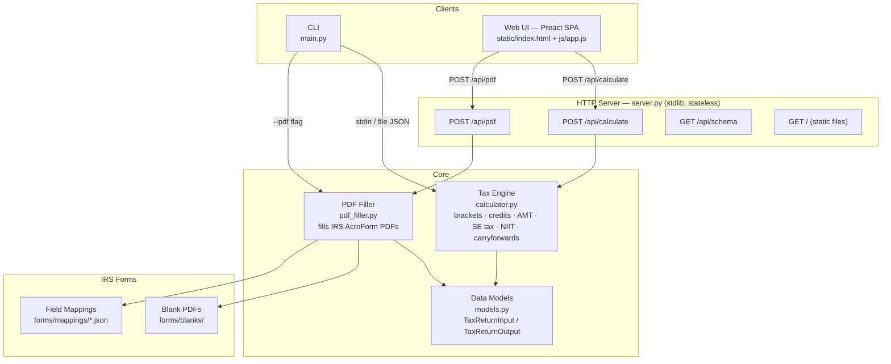

# taxes-bot

Federal individual income tax calculator for **tax year 2025**.

A CLI tool, computation engine, and web UI for computing U.S. federal
individual income tax returns. The entire runtime is zero-dependency
Python (stdlib only). The web frontend is a Preact single-page app
served by a stdlib HTTP server.

---

## Table of Contents

- [Quick Start](#quick-start)
- [Architecture](#architecture)
- [Tech Stack](#tech-stack)
- [CLI Usage](#cli-usage)
- [Web UI](#web-ui)
- [Docker](#docker)
- [Testing](#testing)
- [Test Recordings](#test-recordings)
- [Project Structure](#project-structure)

---

## Quick Start

**Prerequisites:** Python 3.14+, [uv](https://docs.astral.sh/uv/)

```bash
# Clone and install
git clone <repo-url> && cd taxes-bot
uv sync

# Run the CLI
echo '{"filing_status":"single","w2s":[{"employer":"Acme","wages":75000,"federal_tax_withheld":9000}]}' \
  | uv run python main.py

# Start the web UI
uv run python server.py
# Open http://localhost:8000

# Run all tests
uv run pytest                          # BDD + unit tests
uv run pytest tests/e2e/ -v           # Playwright e2e tests
```

---

## Architecture



**Data flow:**

1. User provides input (JSON via CLI or form via browser).
2. Input is deserialized into a `TaxReturnInput` dataclass.
3. `calculator.calculate()` validates and computes the full return.
4. A `TaxReturnOutput` dataclass is returned (or serialized to JSON).
5. Optionally, `pdf_filler.py` maps output fields onto official IRS AcroForm PDFs.

The web UI is a multi-step wizard with branching logic. All state lives
in the browser (`localStorage`). The server is fully stateless — it
receives a complete input payload, computes the result, and returns it.

---

## Tech Stack

| Layer       | Technology                              | Dependencies              |
|-------------|-----------------------------------------|---------------------------|
| Runtime     | Python 3.14                             | **None** (stdlib only)    |
| Frontend    | Preact + HTM via CDN                    | No build step             |
| Server      | `http.server` (stdlib)                  | No framework              |
| PDF filling | `pdf_filler.py` + pypdf                 | Optional (`--group pdf`)  |
| BDD tests   | pytest + pytest-bdd                     | Dev only                  |
| E2E tests   | Playwright (pytest-playwright)          | Dev only                  |
| Container   | Docker (python:3.14-slim)               | —                         |
| Tooling     | uv (package/project manager)            | —                         |

---

## CLI Usage

```bash
# Compute from a JSON file
uv run python main.py input.json

# Compute from stdin
echo '{ ... }' | uv run python main.py

# Fill IRS PDFs from a JSON file (outputs to ./output/)
uv run python main.py --pdf ./output input.json

# Print input JSON schema
uv run python main.py --schema input

# Print output JSON schema
uv run python main.py --schema output
```

> **PDF filling** requires blank IRS PDFs in `forms/blanks/` and the optional `pdf` dependency group:
> ```bash
> uv run python forms/download_forms.py   # download blank PDFs from irs.gov
> uv sync --group pdf                     # install pypdf
> ```

---

## Web UI

```bash
uv run python server.py
# Server starts on http://localhost:8000
```

The web UI walks the user through a multi-step wizard:

1. Filing status and personal info
2. Income sources (W-2s, 1099s, self-employment, K-1s, retirement, etc.)
3. Deductions (standard vs. itemized)
4. Credits (child tax, education, earned income, premium tax, etc.)
5. Review and compute

Steps are shown or hidden based on branching logic (e.g., self-employment
questions only appear if the user indicates self-employment income).

**API endpoint:**

```
POST /api/calculate
Content-Type: application/json

{ ...TaxReturnInput JSON... }

→ 200 { ...TaxReturnOutput JSON... }
→ 400 { "error": "..." }
```

The server also exposes:

| Endpoint | Method | Description |
|----------|--------|-------------|
| `/` | `GET` | Serves the Preact SPA |
| `/api/calculate` | `POST` | Runs the tax calculator |
| `/api/pdf` | `POST` | Returns a ZIP of filled IRS PDFs |
| `/api/schema` | `GET` | Returns the `TaxReturnInput` JSON Schema |

---

## Docker

```bash
# Build the image
docker build -t taxes-bot .

# Run the web UI on port 8000
docker run -p 8000:8000 taxes-bot

# Open http://localhost:8000
```

The Docker image bundles only the runtime files (`models.py`, `calculator.py`,
`server.py`, `static/`). No dev tooling, tests, or PDF dependencies are included.

---

## Testing

### BDD Tests (pytest-bdd)

Feature files in `tests/features/` with step definitions in `tests/step_defs/`.

```bash
uv run pytest tests/ -v --ignore=tests/e2e
```

### E2E Playwright Tests

68 browser-driven tests that exercise the web UI end-to-end. Tests are
split into two categories:

- **9 full wizard flow tests** — navigate every wizard step from start to
  finish for different filing scenarios.
- **59 state-injection tests** — inject pre-built state into localStorage
  and verify computation results. Faster and more targeted.

```bash
# Install Playwright browsers (first time only)
uv run playwright install --with-deps chromium

# Run all e2e tests
uv run pytest tests/e2e/ -v

# Run only the full wizard flow tests
uv run pytest tests/e2e/test_wizard_flow.py -v

# Run a specific test file
uv run pytest tests/e2e/test_carryforwards_surtaxes.py -v
```

### Unit / Schema Tests

```bash
uv run pytest tests/test_schema.py tests/test_schema_references.py -v
```

---

## Test Recordings

Playwright e2e tests record video of each test run. Videos are saved as
`.webm` files in `test-results/videos/`.

### How to view recordings

Run the tests, then open the `.webm` files from `test-results/videos/`:

```bash
uv run pytest tests/e2e/ -v
# Videos saved to test-results/videos/
# Open with: xdg-open test-results/videos/*.webm  (Linux)
#             open test-results/videos/*.webm       (macOS)
```

### Complete Test List (68 tests)

<details>
<summary><strong>Full Wizard Flow Tests</strong> — 9 tests (test_wizard_flow.py)</summary>

These tests navigate every wizard step from start to finish, filling in
each form field and advancing through each page.

| Test | Description |
|------|-------------|
| `test_wizard_single_w2` | Single filer, $75k W-2, standard deduction |
| `test_wizard_mfj_children` | Married filing jointly, two W-2s, two children |
| `test_wizard_hoh` | Head of household, one child |
| `test_wizard_investment_income` | W-2 + interest + dividends + capital gains |
| `test_wizard_self_employed` | Business income with expenses |
| `test_wizard_education_credits` | W-2, student loan interest, AOTC |
| `test_wizard_married_hsa` | MFJ with family HSA contribution |
| `test_wizard_itemized` | MFJ, itemized deductions (mortgage, SALT, charity) |
| `test_wizard_retirement` | Senior with Social Security + pension |

</details>

<details>
<summary><strong>Basic Filing</strong> — 3 tests</summary>

| Test | File | Description |
|------|------|-------------|
| `test_single_w2_75k` | test_single_w2_standard.py | Single filer with $75k W-2 wages, standard deduction |
| `test_mfj_130k_two_children` | test_married_joint_children.py | Married filing jointly, $130k combined, two qualifying children |
| `test_hoh_55k_one_child` | test_head_of_household.py | Head of household, $55k income, one child |

</details>

<details>
<summary><strong>Income Types</strong> — 5 tests</summary>

| Test | File | Description |
|------|------|-------------|
| `test_single_investment_income` | test_single_investment_income.py | Interest, dividends, and capital gains alongside W-2 |
| `test_self_employed_120k` | test_self_employed.py | $120k self-employment income with business expenses, SE tax |
| `test_single_retiree_ss_pension` | test_retirement_income.py | Social Security benefits + pension, taxable SS computation |
| `test_partnership_k1` | test_k1_income.py | Partnership K-1 ordinary income and guaranteed payments |
| `test_scorp_k1` | test_k1_income.py | S-Corp K-1 income with distributions |

</details>

<details>
<summary><strong>Deductions & Credits</strong> — 3 tests</summary>

| Test | File | Description |
|------|------|-------------|
| `test_education_credits_aotc` | test_education_credits.py | American Opportunity Tax Credit + student loan interest deduction |
| `test_married_hsa_family` | test_married_hsa.py | MFJ family HSA contribution, above-the-line deduction |
| `test_mfj_itemized_180k` | test_married_itemized.py | Itemized deductions: mortgage interest, SALT (capped at $10k), charitable |

</details>

<details>
<summary><strong>Special Situations</strong> — 6 tests</summary>

| Test | File | Description |
|------|------|-------------|
| `test_iso_triggers_amt` | test_amt.py | ISO exercise creates AMT preference item, triggers AMT |
| `test_high_earner_no_amt` | test_amt.py | High earner with no AMT preference items — no AMT owed |
| `test_eitc_denied_excess_investment` | test_eitc.py | EITC denied due to investment income exceeding threshold |
| `test_eitc_eligible_one_child` | test_eitc.py | EITC eligible: one qualifying child, income within limits |
| `test_ptc_with_advance_payments` | test_premium_tax_credit.py | Premium tax credit reconciliation with advance payments |
| `test_ptc_above_400_fpl` | test_premium_tax_credit.py | Income above 400% FPL — must repay advance PTC |

</details>

<details>
<summary><strong>New Income & Credits</strong> — 16 tests (test_new_income_credits.py)</summary>

| Test | Description |
|------|-------------|
| `test_adoption_credit_special_needs` | Adoption credit for special needs child (full credit) |
| `test_adoption_credit_high_income_phaseout` | Adoption credit phased out at high AGI |
| `test_elderly_disabled_credit_qualifies` | Elderly/disabled credit for qualifying taxpayer |
| `test_elderly_disabled_credit_high_agi` | Elderly/disabled credit zeroed out by high AGI |
| `test_royalties_book` | Royalty income from book publishing (not SE) |
| `test_royalties_oil_gas_se` | Oil/gas royalty income treated as self-employment |
| `test_farm_income_profitable` | Profitable farm with Schedule F income |
| `test_farm_income_loss` | Farm loss (limited by at-risk rules) |
| `test_alimony_pre_2019` | Alimony from pre-2019 agreement (deductible) |
| `test_alimony_post_2018` | Alimony from post-2018 agreement (not deductible) |
| `test_gambling_itemized` | Gambling winnings with itemized losses deduction |
| `test_gambling_standard` | Gambling winnings with standard deduction (no loss deduction) |
| `test_annuity_exclusion_ratio` | Annuity income with exclusion ratio method |
| `test_annuity_simplified_method` | Annuity income with simplified method |
| `test_scholarship_room_board` | Scholarship: room & board portion is taxable |
| `test_scholarship_fully_qualified` | Scholarship: fully qualified (tuition only, not taxable) |

</details>

<details>
<summary><strong>Carryforwards & Surtaxes</strong> — 26 tests (test_carryforwards_surtaxes.py)</summary>

| Test | Description |
|------|-------------|
| `test_nol_carryforward_80pct_limit` | NOL carryforward limited to 80% of taxable income |
| `test_nol_carryforward_fully_absorbed` | NOL carryforward fully absorbed (no remaining carryforward) |
| `test_charitable_carryforward_with` | Charitable contribution carryforward applied |
| `test_charitable_carryforward_without` | No charitable carryforward needed |
| `test_energy_credit_carryforward` | Residential energy credit carryforward from prior year |
| `test_capital_loss_carryforward_short_term` | Short-term capital loss carryforward ($3k annual limit) |
| `test_capital_loss_carryforward_long_term` | Long-term capital loss carryforward |
| `test_kiddie_tax_investment_income` | Kiddie tax applied to child's investment income |
| `test_kiddie_tax_earned_only` | Child with only earned income — no kiddie tax |
| `test_casualty_loss_disaster` | Casualty loss from federally declared disaster |
| `test_casualty_loss_non_disaster` | Non-disaster casualty loss (not deductible post-TCJA) |
| `test_niit_above_threshold` | Net Investment Income Tax (3.8%) — income above threshold |
| `test_niit_below_threshold` | NIIT not triggered — income below threshold |
| `test_additional_medicare_above_threshold` | Additional Medicare Tax (0.9%) on wages above threshold |
| `test_additional_medicare_below_threshold` | No Additional Medicare Tax — wages below threshold |
| `test_529_qualified_distribution` | 529 plan qualified distribution (not taxable) |
| `test_529_non_qualified_distribution` | 529 plan non-qualified distribution (earnings taxable + 10% penalty) |
| `test_like_kind_exchange_no_boot` | Like-kind exchange with no boot — fully deferred gain |
| `test_like_kind_exchange_with_boot` | Like-kind exchange with boot — gain recognized to extent of boot |
| `test_restricted_stock_rsu_vesting` | RSU vesting — income recognized at fair market value |
| `test_restricted_stock_83b_election` | Section 83(b) election — income recognized at grant |
| `test_savings_bond_partial_exclusion` | Education savings bond interest — partial exclusion |
| `test_savings_bond_phaseout` | Education savings bond interest — phased out at high income |
| `test_investment_interest_capped` | Investment interest expense deduction capped at net investment income |
| `test_investment_interest_fully_deductible` | Investment interest expense fully deductible |
| `test_energy_credit_carryforward_unused` | Energy credit carryforward — unused portion carries forward |

</details>

---

## Project Structure

```
taxes-bot/
├── main.py                  # CLI entry point (--pdf, --schema)
├── server.py                # Stdlib HTTP server (web UI + API)
├── calculator.py            # Tax computation engine
├── models.py                # Dataclass models + JSON schema generation
├── pdf_filler.py            # IRS AcroForm PDF filler (requires pypdf)
├── Dockerfile               # Minimal runtime image (python:3.14-slim)
├── static/
│   ├── index.html           # Web UI shell
│   └── js/
│       └── app.js           # Preact SPA wizard
├── forms/
│   ├── download_forms.py    # Downloads IRS blank PDFs from irs.gov
│   ├── field_discovery.py   # Extracts AcroForm field names from PDFs
│   ├── blanks/              # Downloaded IRS PDFs (gitignored)
│   └── mappings/
│       └── f1040.json       # PDF field → output path mapping
├── tests/
│   ├── conftest.py          # Shared BDD fixtures
│   ├── test_schema.py       # JSON schema validation tests
│   ├── test_schema_references.py
│   ├── features/            # BDD feature files (Gherkin)
│   │   ├── single_w2_standard.feature
│   │   ├── married_joint_w2_children.feature
│   │   ├── head_of_household.feature
│   │   ├── single_investment_income.feature
│   │   ├── self_employed.feature
│   │   ├── retirement_income.feature
│   │   ├── k1_income.feature
│   │   ├── education_credits.feature
│   │   ├── married_hsa.feature
│   │   ├── married_itemized.feature
│   │   ├── amt.feature
│   │   ├── eitc_eligibility.feature
│   │   ├── premium_tax_credit.feature
│   │   ├── new_income_credits.feature
│   │   └── carryforwards_and_surtaxes.feature
│   ├── step_defs/           # BDD step implementations
│   │   └── *.py
│   └── e2e/                 # Playwright browser tests
│       ├── conftest.py      # E2E fixtures, server lifecycle, video recording
│       ├── test_wizard_flow.py
│       ├── test_single_w2_standard.py
│       ├── test_married_joint_children.py
│       ├── test_head_of_household.py
│       ├── test_single_investment_income.py
│       ├── test_self_employed.py
│       ├── test_retirement_income.py
│       ├── test_k1_income.py
│       ├── test_education_credits.py
│       ├── test_married_hsa.py
│       ├── test_married_itemized.py
│       ├── test_amt.py
│       ├── test_eitc.py
│       ├── test_premium_tax_credit.py
│       ├── test_new_income_credits.py
│       └── test_carryforwards_surtaxes.py
├── test-results/
│   └── videos/              # Playwright video recordings (.webm)
├── pyproject.toml
├── uv.lock
└── title-26.json            # IRC Title 26 reference data
```

---

## License

This project is for educational and personal use. It is not tax advice.
Consult a qualified tax professional for your actual tax filing.
